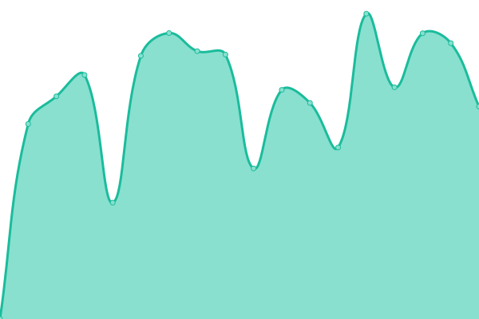

# [📈 Live Status](https://demo.upptime.js.org): <!--live status--> **🟧 Partial outage**

This repository contains the open-source uptime monitor and status page for [Lucas Hahmann](hahmann-trier.de), powered by [Upptime](https://github.com/upptime/upptime).

With [Upptime](https://upptime.js.org), you can get your own unlimited and free uptime monitor and status page, powered entirely by a GitHub repository. We use [Issues](https://github.com/lucashahmann/uptime-hahmann-trier-de/issues) as incident reports, [Actions](https://github.com/lucashahmann/upptime-hahmann-trier-de/actions) as uptime monitors, and [Pages](https://demo.upptime.js.org) for the status page.

<!--start: status pages-->
<!-- This summary is generated by Upptime (https://github.com/upptime/upptime) -->
<!-- Do not edit this manually, your changes will be overwritten -->
<!-- prettier-ignore -->
| URL | Status | History | Response Time | Uptime |
| --- | ------ | ------- | ------------- | ------ |
|  [Nextcloud](https://nextcloud.hahmann-trier.de) | 🟥 Down | [nextcloud.yml](https://github.com/LucasHahmann/uptime-hahmann-trier-de/commits/HEAD/history/nextcloud.yml) | 

 948ms
     
 | 

<a href="https://status.hahmann-trier.de/history/nextcloud">63.39%</a>
    

|  [Psono](https://psono.hahmann-trier.de) | 🟥 Down | [psono.yml](https://github.com/LucasHahmann/uptime-hahmann-trier-de/commits/HEAD/history/psono.yml) | 

 2711ms
     
 | 

<a href="https://status.hahmann-trier.de/history/psono">86.98%</a>
    

|  [Gitea](https://git.hahmann-trier.de) | 🟥 Down | [gitea.yml](https://github.com/LucasHahmann/uptime-hahmann-trier-de/commits/HEAD/history/gitea.yml) | 

 714ms
     
 | 

<a href="https://status.hahmann-trier.de/history/gitea">86.99%</a>
    

|  [Wordpress](https://www.hahmann-trier.de) | 🟩 Up | [wordpress.yml](https://github.com/LucasHahmann/uptime-hahmann-trier-de/commits/HEAD/history/wordpress.yml) | 

 516ms
     
 | 

<a href="https://status.hahmann-trier.de/history/wordpress">100.00%</a>
    

|  [Athenia Wiki](https://athenia.wiki) | 🟩 Up | [athenia-wiki.yml](https://github.com/LucasHahmann/uptime-hahmann-trier-de/commits/HEAD/history/athenia-wiki.yml) | 

 2093ms
     
 | 

<a href="https://status.hahmann-trier.de/history/athenia-wiki">86.65%</a>
    

<!--end: status pages-->

[**Visit our status website →**](https://demo.upptime.js.org)

## 📄 License

- Powered by: [Upptime](https://github.com/upptime/upptime)
- Code: [MIT](./LICENSE) © [Anand Chowdhary](https://anandchowdhary.com), supported by [Pabio](https://pabio.com)
- Data in the `./history` directory: [Open Database License](https://opendatacommons.org/licenses/odbl/1-0/)
